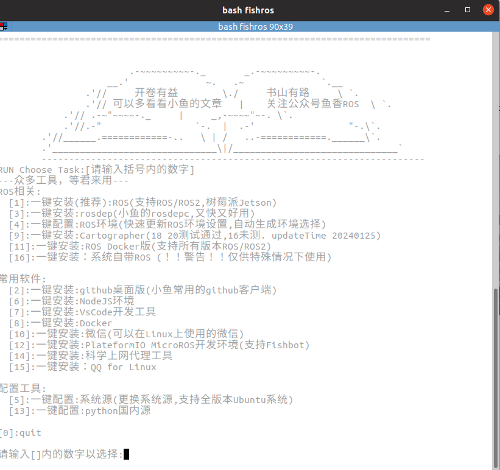
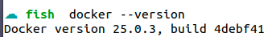
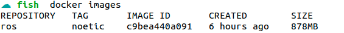
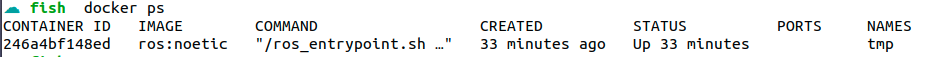
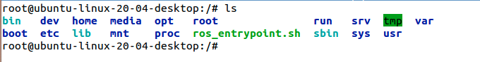
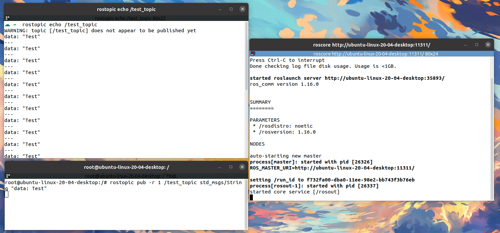

# Ros-Noetic-Docker-Bridge

这个项目主要为了实现docker和ros系统在Ubuntu上的通信。简而言之就是docker可以向宿主机的话题发布消息，并且主机可以接收到来自docker的消息，由于docker具有良好的封闭性，因此可以将任何的ros项目保存在docker下，并且迁移到任何平台下直接运行。


## 利用fishros下载docker和images

### 安装docker

该项目需要对docker有一定的了解。在terminal中输入如下命令，

```shell
wget http://fishros.com/install -O fishros && . fishros
```

然后得到如下界面，



然后输入8，一键安装docker，此时fishros会根据当前系统以及架构安装合适的docker应用。按照所给定的提示安装完成之后，使用如下命令检查docker是否已经安装成功，

```shell
docker --version
```

得到版本信息之后，就说明安装成功了。




### 拉取镜像

由于docker hub中ros的镜像太多，而且有些还有其他小问题，因此依然使用fishros下载好镜像。

```
. fishros
```

得到了刚刚的界面之后，选择11，一键安装 ROS docker版本，然后按照他的提示一步一步进行，**我在这里下载的是noetic版本**。但是fishros会自动创建一个docker实例，但是这个容器和系统共享所有用户文件的，这不是我们希望的。因此可以先删除这个docker实例。

```shell
docker ps -a # 查看所有镜像
docker rm <CONTAINER ID>  # <CONTAINER ID>换成对应的容器id
```

然后查看一下目前的镜像，

```shell
docker images  
```



可以看到有一个名字为ros的镜像，这个就是拉取下来的镜像，重新创建一个新实例，

```shell
docker run -it -d --network=host --name=<CONTAINER NAME> <IMAGE ID>
# 示例
# docker run -it -d --network=host --name=tmp c9bea440a091
```

然后查看一下创建的实例

```shell
docker ps
```



然后就可以进入容器了，

```shell
docker exec -it 246a4bf148ed /bin/bash
# 246a4bf148ed是容器的id，由于是随机的，可能会不一样
```

然后就进入到了docker容器的内部，



每次docker重新开机都需要source一下ros的基本路径，

```shell
. ros_entrypoint.sh
```


## 测试

接着在宿主机上面打开第一个终端，输入

```shell
roscore
```

再开一个新的终端，监听话题/test_topic，输入

```
rostopic echo /test_topic
```

再开一个新的终端，进入docker

```shell
docker exec -it 246a4bf148ed /bin/bash
```

进入了docker之后，再发送消息，输入

```shell
rostopic pub -r 1 /test_topic std_msgs/String "data: Test"
```

然后docker内部运行的程序就可以成功宿主机发送ros消息了。


